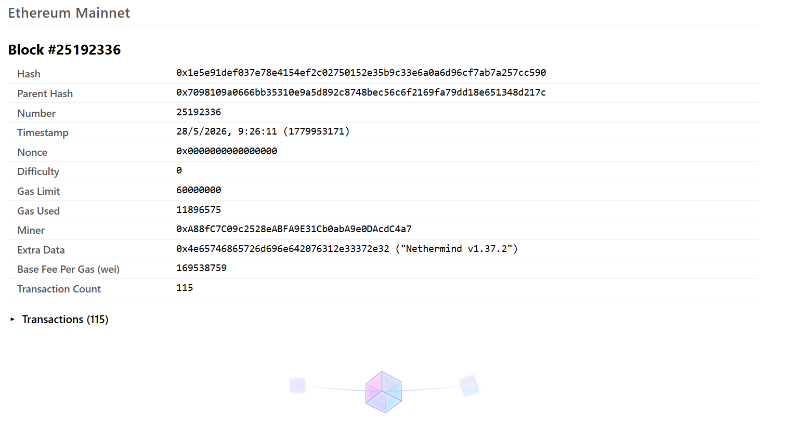
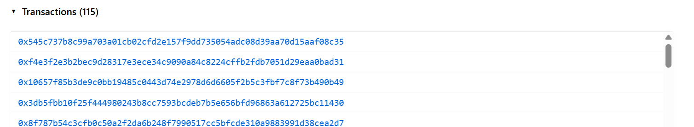
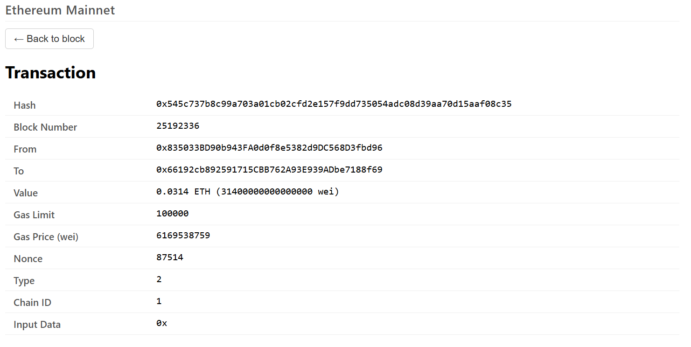
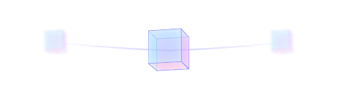

# SOLUTION — Block Explorer (Weekly Project 3)

> Original challenge: see [README.md](./README.md).

My completed solution to the third weekly project of the Web3 roadmap: a React-based Ethereum **block explorer** that walks the chain block-by-block, drills into any transaction, and is built on the AlchemySDK (a thin wrapper over `ethers.js`).

The scaffold rendered a single block number. Everything below is what I added.

---

## What this project does

- Loads the latest block from Ethereum Mainnet via `alchemy.core.getBlockNumber()` on mount, then `alchemy.core.getBlock(n)` for the full block.
- Renders the block as a labeled table (hash, parent hash, timestamp, gas, miner, base fee, extra data, transaction count, etc.).
- Lets the user **walk the chain** with a 3D **crystal-cube carousel** at the bottom — keyboard `←/→` or click the side cubes. Two extra "off-screen" cubes per side give the carousel depth.
- Lists the block's transactions in a collapsible panel. Clicking a tx hash swaps the view for a **transaction detail** screen (back button returns to the block).
- Shows the active network as a header (`Ethereum Mainnet`) derived from the SDK config, not hardcoded — so swapping `Network.ETH_MAINNET` for `Network.ETH_SEPOLIA` updates the UI automatically.
- Decodes the block's `extraData` hex into UTF-8 when printable (Mainnet blocks built by Titan etc. show their signature in plaintext).
- Animated collapse: the transaction list expands smoothly via `max-height` transition, and the cube nav slides offscreen in lockstep via a matched `transform` — single fluid motion instead of teleport-then-animate.
- Responsive typography: `clamp()` on font sizes, padding, and the container width so the layout grows from a tight laptop fit (1366×768) up through ultrawide monitors without leaving large bottom gaps.

---

## Architecture

```
App.js  ← top-level state: { latestBlock, currentBlock, selectedTx }
 │
 ├─ <header>           ← networkLabel from AlchemyClient.js
 │
 ├─ if selectedTx:
 │    Transaction      ← alchemy.core.getTransaction(hash) → detail table + back
 │
 ├─ else:
 │    Block            ← alchemy.core.getBlock(n) → metadata table
 │      └─ tx-section  ← collapsible (React state), animated max-height
 │           └─ <button class="tx-link">  → onSelectTx(hash) sets selectedTx
 │
 │    BlockNavigator   ← carousel of CrystalCube ×5 (off-left, left, center, right, off-right)
 │      └─ arrow-key handler (window keydown) → onPrev / onNext
 │      └─ CSS :has(.tx-section.open) → transform: translateY(140px)  [slide offscreen]
 │
 └─ AlchemyClient.js   ← singleton Alchemy({ apiKey, network }) + networkLabel
```

### Block ↔ Transaction routing

A single boolean-ish piece of state (`selectedTx`) in `App.js` acts as a router: truthy → Transaction view, falsy → Block view + BlockNavigator. No React Router needed for a two-screen app. `onSelectTx` is passed down to Block → tx-link buttons.

### `BlockNavigator.js` — the cube carousel

For each render, I compute a `slots` array with up to five entries:

```
[ {id: n-2, slot: 'off-left'},
  {id: n-1, slot: 'left',   onClick: onPrev},
  {id: n,   slot: 'center'},
  {id: n+1, slot: 'right',  onClick: onNext},
  {id: n+2, slot: 'off-right'} ]
```

The "off" slots only render at the edges (`canPrev && n-2 >= 0`, `canNext && n+2 <= latest`). Each slot is an absolutely positioned `<button>` keyed by block number — when the user clicks "next," React reuses the same DOM node for the new center and animates the transform from the `right` position to `center`, giving a real carousel feel instead of a redraw.

Arrow keys: a `window.addEventListener('keydown', ...)` inside `useEffect`, skipping when focus is in an input/textarea or when modifier keys are held.

### `Block.js` — collapse animation

Originally built on native `<details>` + a `setTimeout` hack to delay the close so the cube could slide back in. That looked janky because `<details>` toggles content visibility instantly — the cube would teleport (because content above grew/shrank in one frame) then animate.

Replaced with a React-controlled collapsible: `txOpen` state, a `<button class="tx-toggle">` (mimics the `<summary>` disclosure triangle with a rotating `::before`), and a `<div class="tx-collapse">` whose `max-height` transitions 0 ↔ `clamp(380px, 40vh, 720px)` over 400ms. The cube nav's `transform: translateY(140px)` uses the same duration and easing, so both animations are one motion to the eye.

### `AlchemyClient.js` — derived network label

```js
const settings = { apiKey: ..., network: Network.ETH_MAINNET };

const NETWORK_LABELS = {
  [Network.ETH_MAINNET]: 'Ethereum Mainnet',
  [Network.ETH_SEPOLIA]: 'Ethereum Sepolia',
  [Network.ETH_HOLESKY]: 'Ethereum Holesky',
};

export const networkLabel = NETWORK_LABELS[settings.network] ?? settings.network;
```

Single source of truth: change the `network` value, the header updates. Falls back to the raw enum value if the label map doesn't cover it.

---

## Design choices

| Concern | Choice |
|---|---|
| Routing | Single `selectedTx` state in `App.js` — Block view vs. Transaction view are mutually exclusive |
| Block navigation UI | 5-slot cube carousel with side cubes clickable, off-cubes adding depth, arrow-key shortcuts |
| Collapsible transactions | React-controlled wrapper (not native `<details>`) so `max-height` can be animated |
| Animation sync | Same 400ms `cubic-bezier(0.4,0,0.2,1)` on both the collapse wrapper and the cube nav transform |
| Network label | Derived from the SDK `settings.network` via a lookup table, not hardcoded text |
| Extra-data display | Try UTF-8 decode of the hex; show `"Titan (titanbuilder.xyz)"` style suffix when printable |
| Responsive sizing | `clamp(min, vw-based, max)` on font sizes, padding, container `max-width`, and tx-list `max-height` |
| Cube nav anchoring | `margin-top: auto` in a `min-height: 100vh` flex column — sits at viewport bottom on tall monitors, just below content on laptop |

---

## What's in scope vs. out of scope

**In scope (README) — done:**
- Block details beyond just the block number (`alchemy.core.getBlock`).
- Transaction list per block.
- Click-through from a transaction in the list to its details (`alchemy.core.getTransaction`).
- Block-by-block navigation.

**Out of scope for this exercise — flagging for future me:**
- **Account / balance lookup page** (README idea #5). Foundation is there — would need another top-level state and a third view.
- **Direct block search** (input "go to block N" or paste a hash). Currently you can only walk one block at a time.
- **Live tip updates via WebSocket.** `alchemy.ws.on('block', ...)` would auto-advance `latestBlock` as new blocks are mined.
- **Transaction receipt details** (`getTransactionReceipt`) — currently the Transaction view shows the request data; the receipt has logs, status, gasUsed, etc.
- **NFT / Transact / Notify APIs** (README §6). Not relevant for an explorer of "what's on chain right now" but Alchemy's specialized endpoints would let this become a richer dapp dashboard.
- **Network switcher in the UI.** `networkLabel` already derives from config, so the JSX is ready — just needs a `<select>` and a way to rebuild the Alchemy instance.
- **ENS resolution** of `from` / `to` / `miner` addresses to readable names — nice-to-have, one extra RPC call per address.

---

## How to exercise the flow

After setting `REACT_APP_ALCHEMY_API_KEY` in `.env` per the [README](./README.md):

```
npm install
npm start          # serves at http://localhost:3000
```

1. The page loads the latest Mainnet block. Block details fill the table; `Transactions (N)` sits collapsed at the bottom.
2. Press `←` or click the left cube to step back one block; `→` or the right cube to step forward (capped at `latestBlock`).
3. Click `Transactions (N)` — the panel expands smoothly and the cube nav slides offscreen in the same motion.
4. Click any transaction hash to swap to the Transaction view. `← Back to block` returns you to the block you came from.
5. Resize the window from laptop width up to ultrawide — typography and spacing scale via `clamp()`; the cube nav re-anchors to the viewport bottom on tall screens.

---

## How it looks









---

## File map

```
blockexplorer/
├── src/
│   ├── App.js                       # top-level state, network header, Block ↔ Transaction routing
│   ├── App.css                      # fluid container (clamp max-width + padding)
│   ├── AlchemyClient.js             # Alchemy singleton + networkLabel derivation
│   └── components/
│       ├── block/
│       │   ├── Block.js             # block metadata table + animated collapsible tx list
│       │   └── Block.css            # clamp-scaled table, tx-collapse max-height transition
│       ├── transaction/
│       │   ├── Transaction.js       # tx detail table + back button
│       │   └── Transaction.css
│       ├── block-navigator/
│       │   ├── BlockNavigator.js    # 5-slot cube carousel + arrow-key handler
│       │   └── BlockNavigator.css   # slot transforms, slide-offscreen via :has(.tx-section.open)
│       └── crystal-cube/
│           ├── CrystalCube.js       # 6-face 3D primitive
│           └── CrystalCube.css      # iridescent gradient faces
└── docs/                            # screenshots referenced above
```
